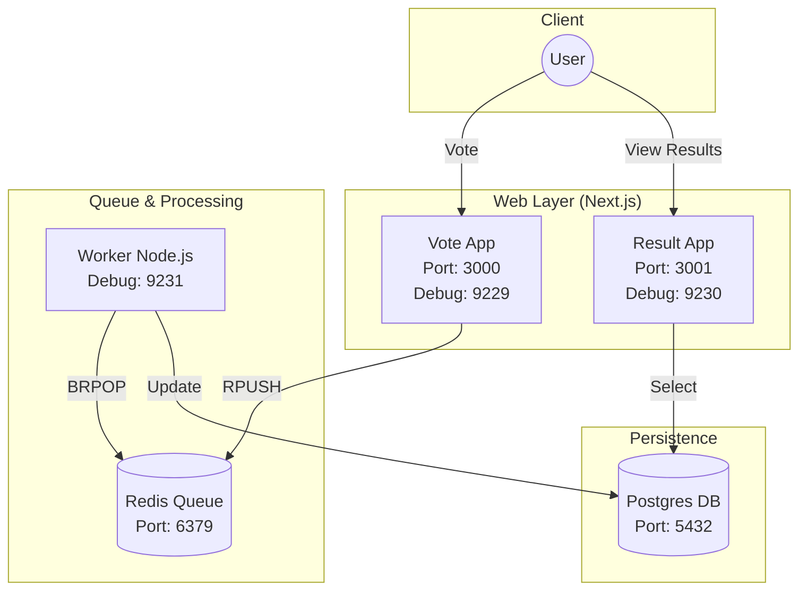

# Design: Recreate Voting App

## Architecture Overview
The system follows a classic microservices pattern with a message queue (Redis) for decoupling writes and a relational database (Postgres) for persisted state.



### Components
1. **Vote Service (Next.js)**
   - Port: `3000`
   - Debug Port: `9229`
   - Tech: Next.js (App Router), TypeScript, `ioredis`.
   - Responsibility: Accept POST requests for votes, push to Redis `votes` list.

2. **Redis**
   - Port: `6379`
   - Responsibility: Temporary storage for votes.

3. **Worker Service (Node.js)**
   - Debug Port: `9231`
   - Tech: Node.js, TypeScript, `pg`, `ioredis`.
   - Responsibility: `BRPOP` from Redis, update Postgres counts.

4. **Postgres**
   - Port: `5432`
   - Responsibility: Store aggregated vote counts.
   - Schema: `votes` table (`id` (string/PK), `votes` (int)).

5. **Result Service (Next.js)**
   - Port: `3001`
   - Debug Port: `9230`
   - Tech: Next.js (App Router), TypeScript, `pg`.
   - Responsibility: Read from Postgres, display live dashboard.

## Data Flow
1. User clicks "A" or "B" in **Vote UI**.
2. **Vote API Route** sends `RPUSH votes '{"vote": "a"}'` to Redis.
3. **Worker** is blocked on `BLPOP votes 0`.
4. **Worker** receives vote, runs `INSERT ... ON CONFLICT UPDATE` in Postgres.
5. **Result UI** fetches data from Postgres (optionally via polling or SSE).

## Debugging Strategy
Each service will have an `--inspect=0.0.0.0:<port>` flag in its development start command.
Ports are mapped in `docker-compose.yml` to allow IDE attachment from the host.

## Project Structure
```
JSLab/PersonalProjects/voting-app/
├── services/
│   ├── vote/
│   ├── result/
│   └── worker/
├── docker-compose.yml
└── .vscode/
    └── launch.json
```
