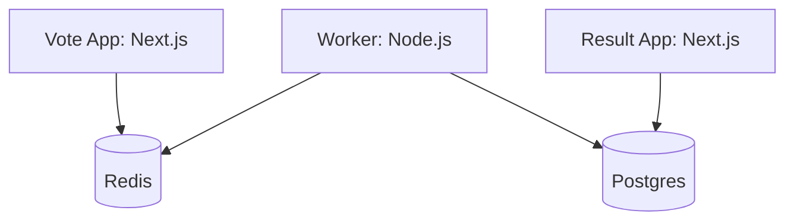

# Voting App Specification

A multi-service voting application recreated with a modern Node.js/Next.js stack, based on the classic Docker example-voting-app.

## System Architecture

The application consists of five main services:

1.  **Vote (Next.js):** Frontend for users to cast their votes.
2.  **Result (Next.js):** Frontend to display voting results in real-time.
3.  **Worker (Node.js):** Background service that processes votes from Redis and persists them to Postgres.
4.  **Redis:** In-memory message queue/buffer for votes.
5.  **Postgres:** Persistent storage for the final vote counts.

## Functional Requirements

### Vote Service
- Present a simple interface with two options (e.g., "Cats" vs "Dogs").
- Capture user choice and push it to the Redis queue.
- Provide immediate feedback to the user after voting.

### Worker Service
- Consume vote messages from the Redis queue.
- Update the Postgres database with the latest vote counts.
- Ensure "at-least-once" processing or idempotency if possible.

### Result Service
- Fetch current vote tallies from Postgres.
- Display results in a clear, visual format (e.g., percentage bars).
- Update in real-time (or near real-time) as new votes are processed.

## Technical Constraints

- **Language:** TypeScript/JavaScript (Node.js).
- **Framework:** Next.js for both frontend services (`vote` and `result`).
- **Containerization:** All services must run in Docker.
- **Orchestration:** Managed via `docker-compose`.
- **Development:** Support for debugging each service individually within the containerized environment.
- **Persistence:** Votes must persist across service restarts via Postgres.

## Future Extensibility
- Authentication (OAuth/Simple).
- Multiple concurrent polls.
- Historical data visualization.
